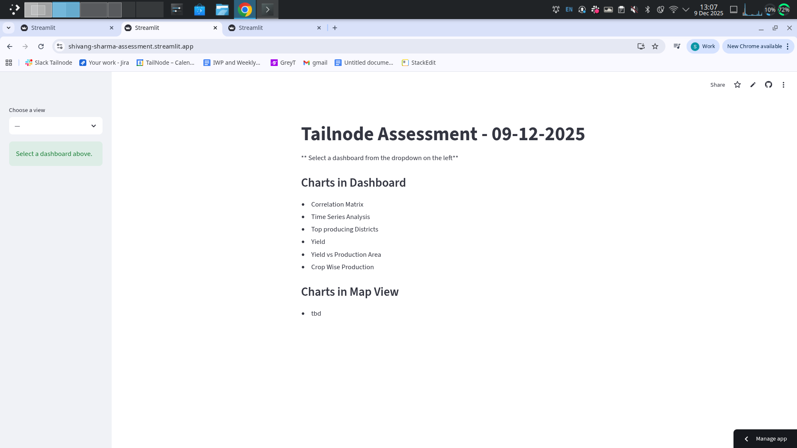
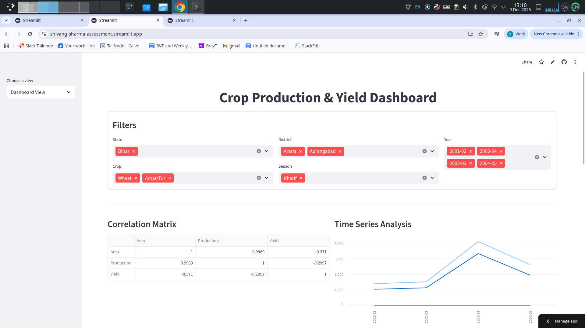
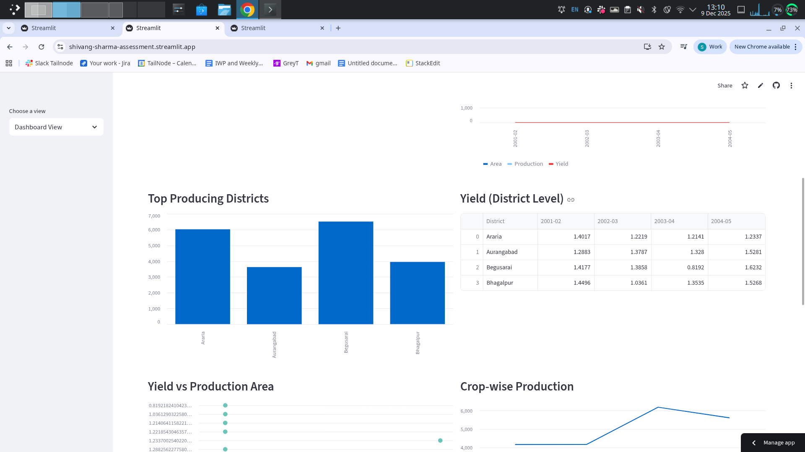
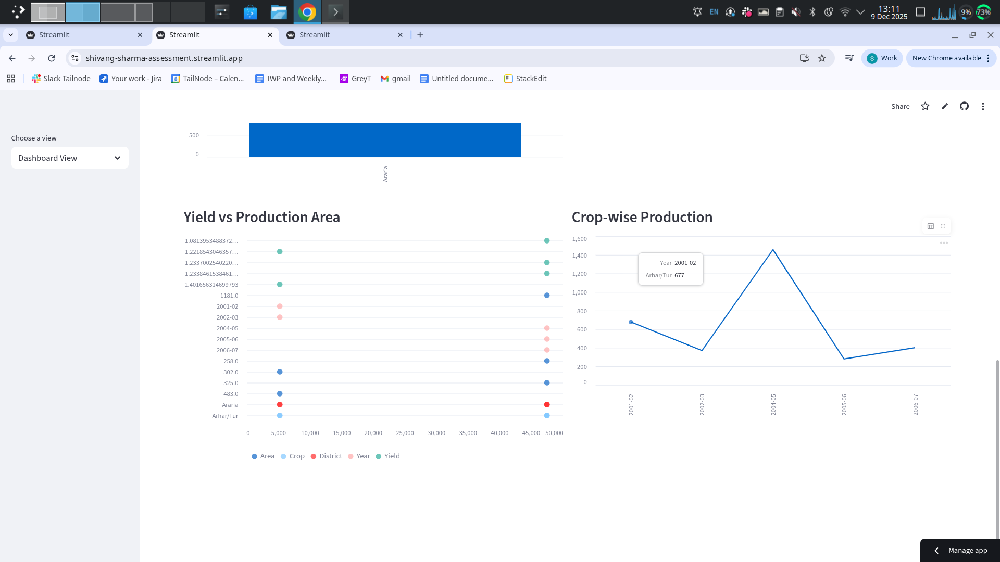

# Tailnode Assessment (Shivang) - 09 Dec 2025


## Setting Up

Install project with python

- Create a python virtual env `python -m venv <env-name>`
- Activate the environment
- Install dependencies `pip install -r requirements.txt`
- Run the app on local server `streamlit run app.py`


## Code structuring

- App is divided into seperate module for dashboard and maps(to be added)
- Main control takes place in app.py, with a basic sidebar page from the tutorial https://docs.streamlit.io/get-started/tutorials/create-a-multipage-app
- Data loading is followed by sanity/normalisation checks with cache on loading for better performance.
- Waterflow type conditionals are placed to allow only sequential selection of dropdowns.
- A seperate utils function exist for each chart that prepare its corresponding dataframe for visualization.


## Running Tests

To run tests, run the following command, this will start running test cases

```bash
  pytest -q
```


## Screenshots





